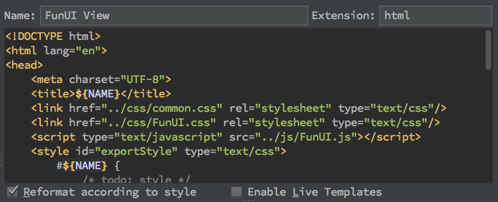

# FunUI开发文档
潘占东 2017.1

[toc]
##1 一点儿背景
在进驻Slay.one时，游戏的前端代码结构凌乱，虽已几经重构，但是距离可以方便快速开发还有非常大的距离，急需一个完整的框架来解决这件事情，以避免前端的开发成为整个游戏开发过程的瓶颈。

最初的想法是选择一个开源的框架，于是对一些目前流行的UI框架进行了调研，但结果却不尽如人意。几经取舍之下，最终决定在需求迭代的过程中，快速实现一个微型、轻量而灵活的自研框架，这便是FunUI的产生背景。

###1.1 特点

1. 开发人员完全用HTML、CSS来实现布局，Javascript脚本可专注于业务逻辑及数据的处理展示上。
2. 功能视图可独立开发、测试，在最终集成前，无需加载整个应用。
3. 数据驱动，数据独立于UI，UI展示数据的变化。
4. 简单、方便的国际化解决方案。
5. 易于集成。
6. ... 

###1.2 MixIn与Trait

为了达到最大限度的利用HTML、CSS的目的，mixin的思想渗透在框架的各个部分，所以在开始框架的使用的介绍之前，有必要将mixin作为前置知识，放在这里。
关于mixin的名词解释，就不展开来说了，这里以如下代码为例着重说一下mixin思想在FunUI中的独特运用：

```javascript
{
    prop: 1,
    __init__: function () {
    },
    foo : function() {
    }
}
```
上面的代码是FunUI框架以及开发过程中非常常见的一种对象模式，在框架里我把它叫做trait，无论是FunUI内置组件的实现还是外部功能View的开发，到处都是一个个trait的定义。

####2.1.1 两段式mix

在代码里包含了一个叫做\_\_init__的函数，这个函数有点像构造函数，他们都是用来做一些初始化的工作。不同点在于：

1. 构造函数用来构造对象，而\_\_init__函数并不构造对象。
2. 构造函数先于被构造的对象出现前执行（废话），而\_\_init__函数在属性和方法全部mix到HTML元素对象之后执行。
3. \_\_init__函数是异步执行的，而在几个trait在一起mix进一个对象时，会先依次复制属性，再依次执行\_\_init__函数。而在一个view第一次被游戏加载时，\_\_init__函数甚至是在mix操作的下一个tick执行的。

虽然在应用开发过程中几乎不会做mixin的操作，但是了解其执行顺序可以更好的开发。

####2.1.2 捆死的this

javascript里跳跃的this一直都是开发之痛，但是在FunUI框架中，混入的方法中包含的this可以安全的使用，所以如下的代码完全不用担心this被污染到，使得函数作为一等公民的权利不再被this所累:

```javascript
{
	prop: 1,
    __init__: function () {
    	window.on('click', this.foo)
    },
    foo : function() {
    	alert(this.prop);
    }
}
```

####2.1.3 mixin的顺序

1. 组件trait，如class为"F-Window"所代表的FunUI.components.Winodw最先混入。
2. FunUI.traits.elementId 的方式定义的trait随后混入.
3. 通过data-prop的方式定义的html属性，会最后混入。

在FunUI中，后面混入的属性会覆盖先混入的同名属性和方法。


###1.2 强大的ArrayView

在FunUI中一个非常大的创新便是ArrayView。
在游戏应用里经常有各种列表、表格等控件展示，而这些控件的展示同时会伴随着搜索、排序、分页等操作，ArrayView是这样一个组件，把它与一个数组关联，剩下的事情都由它来帮你完成。它通过事件通知的方式来触发列表、表格、下拉列表等组件的渲染更新，以此为手段实现真正的数据驱动，协助我们从各种forEach中解脱出来。

##2 举个栗子

###2.1 开发环境
因为框架是在项目开发过程中诞生，为了简化也尽可能利用目前项目所使用的目录结构、开发工具、构建工具等环境，如Idea IDE、Grunt等。唯一需要开发人员做的便是，将FunUI的view模板配置在IDE里，配置过程如下：
References->Editor->File and code Templates
点击+按钮，按如下填写：



模板代码如下：

```html
<!DOCTYPE html>
<html lang="en">
<head>
    <meta charset="UTF-8">
    <title>${NAME}</title>
    <link href="../css/common.css" rel="stylesheet" type="text/css"/>
    <link href="../css/FunUI.css" rel="stylesheet" type="text/css"/>
    <script type="text/javascript" src="../js/FunUI.js"></script>
    <style id="exportStyle" type="text/css">
        #${NAME} {
            /* todo: style */
        }
    </style>
    <script id="en" class="F-Lang" type="application/json">
        {
        }
    </script>
</head>
<body bgcolor="black">
<div id="${NAME}">
    <!-- todo: layout -->
</div>
<script id="exportScript" type="text/javascript">
    FunUI.traits.${NAME} = {
        __init__ : function() {
            // todo: trait code
        }
    };
</script>
<script id="testScript" type="text/javascript">
    F$("${NAME}").on(FunUI.events.INITIALIZED, function (e) {
        // todo: test code
    });
</script>
</body>
</html>
```
在新建文件时，选择FunUI View即可。
###2.2 开发规范
view模板初看和普通的html文档一般无二，这也是实现最初定下的宏伟目标的基础，即可以通过浏览器像打开一个普通网页一样来打开正在开发的视图。浏览有丰富的工具可以协助视图布局、逻辑的调试，使得在最终集成前无需load整个游戏。与普通HTML不同的是，View在普通的HTML基础上，制定了一些必须遵守的规范，并以此为基础实现自动化集成。

以下将以一个简单的view的开发过程来展示规范的细节。

####2.2.1 创建View

首先，view必须创建在src/views目录下，且不可以有子目录。这样做的目的不仅仅是一个简单的目录规划，更要求views目录与css、imgs目录同级，这样才能保证views的最终编译结果能够和预览结果完全一致。

我们在views下点右键，选择New->FunUI View，并命名为sample，创建文件的内容如下：

```html
<!DOCTYPE html>
<html lang="en">
<head>
    <meta charset="UTF-8">
    <title>sample</title>
    <link href="../css/common.css" rel="stylesheet" type="text/css"/>
    <link href="../css/FunUI.css" rel="stylesheet" type="text/css"/>
    <script type="text/javascript" src="../js/FunUI.js"></script>
    <style id="exportStyle" type="text/css">
        #sample {
            /* todo: style */
        }
    </style>
    <script id="en" class="F-Lang" type="application/json">
        {
        }
    
    </script>
</head>
<body bgcolor="black">
<div id="sample">
    <!-- todo: layout -->
</div>
<script id="exportScript" type="text/javascript">
    FunUI.traits.sample = {
        __init__: function () {
            // todo: trait code
        }
    };
</script>
<script id="testScript" type="text/javascript">
    F$("sample").on(FunUI.events.INITIALIZED, function (e) {
        // todo: test code
    });
</script>
</body>
</html>
```
后面我们以此View作为蓝本，讲解各个组成部分及其相应实现和规范：

####2.2.2 viewName

viewName是一个View里非常重要的一个属性，对它有如下的要求：

1. view的文件名必须是**[viewName]**.html，如例子的文件名应该是sample.html
2. exportStyle中所有样式的前缀必须以**#[viewName]**作为前缀，如例子中的**#sample**
3. view的布局的html元素的id必须为**viewName**，如例子中的**sample**元素

因为这些都已在模板里帮助开发人员实现，所以除非故意去修改，否则无需对其花费额外的经历。

####2.2.3 view Element

view中id为viewName的元素即为最终会集成进游戏里的元素，可以通过html配合FunUI实现的组件及相应的css实现view的布局。

####2.2.4 exportStyle

```html
<style id="exportStyle" type="text/css">
    #sample {
        /* todo: style */
    }
</style>
```
exportStyle元素是我们的View的css样式表，这段css代码最终会集成到游戏里。为了避免样式的互相污染，要求这里定义的样式必须以**#[viewName]**作为前缀，如例子中的**#sample**

####2.2.5 exportScript

```html
<script id="exportScript" type="text/javascript">
    FunUI.traits.sample = {
        __init__: function () {
            // todo: trait code
        }
    };
</script>
```
exportScript是最终会集成进游戏的逻辑。你可能已经注意到模板代码FunUI.traits.sample，这是FunUI为了实现自动混入而引入的一种全局机制，即模式为FunUI.traits.[elementId]的所有对象，都会自动混入到相应的HTMLElement里。例如当前的代码最终会被混入到id为sample的元素里。
实际上，exportScript可以编写任何逻辑所需的代码，这里除了通过FunUI.traits或者其他全局变量导出的对象外，其他的函数、变量都会被限定再自己的作用域内，而不用担心被外部污染。比如，完全可以编写如下的代码，无须担心变量model和函数showName会和应用的其他变量函数产生冲突:

```javascript
var model = {name: "Bingo"};
function showName() {
	alert(model.name);
}

FunUI.traits.sample = {
    __init__: function () {
    	this.on('click', showName);
    }
};

```
####2.2.6 testScript

```html
<script id="testScript" type="text/javascript">
    F$("sample").on(FunUI.events.INITIALIZED, function (e) {
        // todo: test code
    });
</script>
```
testScript以及该view模板里的任何非id为exportScript的javascript脚本块都不会集成到游戏里，所以无论id是不是testScript，都可以用当做view逻辑的测试代码，用以检验已完成代码的有效性。
####2.2.7 国际化
在当前代码中用于国际化的元素主要是class为**F-Lang**的json脚本集，需要注意的是元素的id，如下代码为语言为**en**的语言配置：

```html
    <script id="en" class="F-Lang" type="application/json">
        {
        	"sample.lang.sample": "hello,world"
        } 
    </script>
```

我们可以以此为模板添加多个语言集合如:

```html
    <script id="cn" class="F-Lang" type="application/json">
        {
        	"sample.lang.sample": "你好，世界"
        } 
    </script>
```

在view Element中使用语言非常的简单，在html中只需要用\_()将key括起来，而脚本中通过F\_()引用即可，代码如下：

```html
<span>_(sample.lang.sample)</span>
<script>
	var text = F_('sample.lang.sample'));
</script>
```
而如果想看到不同的语言效果，只需要修改html根元素的lang属性即可，如下，即预览语言为en的视图:

```html
<html lang="en">
```
###2.3 集成
FunUI的集成由Grunt自动化完成，无需认为参与，实际上grunt自动为我们做了如下几件事:

1. 将view Element导出为viewName.layout.js。
2. 将exportScript导出为viewName.trait.js,同时用匿名函数来保护view内定义的函数和变量的作用域。
3. 将exportStyle导出为viewName.css文件。
4. 将各个国际化语言配置合并到相应的国际化配置文件中。

在游戏里调用自定义的view非常简单：

```javascript
var sampleView = F$('sample');
```

##3 组件
###3.1 Window
####3.1.1 布局与风格
```html
<div class="F-Window" data-modal="true">
    <h2 class="title">sample</h2>
    <div class="F-Button close"></div>
    <div class="content">
    </div>
</div>
```


```html
<div class="F-Window light" data-modal="true">
    <div class="F-Button close"></div>
    <div class="content">
    </div>
</div>
```

####3.1.2 事件
```javascript
FunUI.events.ADD_POP_UP
FunUI.events.RMEOVE_POP_UP
```
####3.1.3 属性和方法

```javascript
{
	/**
	 * @option
	 */
	modal: boolean,
	//打开
	open: function(),
	//关闭
	close: function()
}
```

###3.2 Button
####3.2.1 布局与风格

```html
<div class="F-Button"></div>
```


```html
<div class="F-Button large"></div>
```


```html
<div class="F-Button huge"></div>
```


```html
<div class="F-Button green large"></div>
```


```html
<div class="F-Button yellow"></div>
```


```html
<div class="F-Button yellow large"></div>
```


```html
<div class="F-Button brown large"></div>
```


```html
<div class="F-Button light"></div>
```


```html
<div class="F-Button small"></div>
```


```html
<div class="F-Button tiny"></div>
```


```html
<div class="F-Button tiny red"></div>
```


```html
<div class="F-Button search"></div>
```

####3.2.2 事件
```javascript
"click"
```

###3.3 TextInput
####3.3.1 布局与风格
```html
 <div class="F-TextInput"></div>
```


```html
 <div class="F-TextInput shadowed"></div>
```


```html
 <div class="F-TextInput light"></div>
```


```html
 <div class="F-TextInput dark"></div>
```

####3.3.2 事件
```javascript
FunUI.events.TEXT_CHANGED
```
####3.3.3 属性和方法
```javascript
{
	/**
	 * @option
	 */
    multiline: boolean,
	/**
	 * @option
	 */
    password: boolean,
	/**
	 * @option
	 */
    placeholder: string,
    setText(text: String),
    getText()
}
```
###3.4 ViewStack
####3.4.1 布局与风格
```html
<div class="F-ViewStack">
    <div class="subView">
    view 1
    </div>
    <div class="subView">
    view 2
    </div>
</div>
```
####3.4.2 事件
```javascript
FunUI.events.SELECTED_CHANGED
```
####3.4.3 属性与方法
```javascript
{
    getSelectedIndex() : int,
    getCurrentSubView() : HTMLElement,
    selectSubView(index : int),
}
```
###3.5 TabPage
####3.5.1 布局与风格
```html
<ul class="F-TabPage">
    <li class="page">
        <h3 class="title">tab1</h3>
        <div class="content">
        tab1
        </div>
    </li>
    <li class="page">
   	     <h3 class="title">tab2</h3>
        <div class="content">
        tab2
        </div>
    </li>
</ul>
```

####3.5.2 事件
```javascript
FunUI.events.SELECTED_CHANGED
```
####3.5.3 属性与方法
```javascript
{

	/**
	 * @option
	 */
    barAlign: String, //center|left|right
    
	/**
	 * @option
	 */
    barOffsetLeft: int,
    get pageNum: int,
    get selectedIndex: int,
    selectPage(index : int);
}
```
###3.6 Tooltip
####3.6.1 布局与风格
```html
<div id="tooltipSample" class="F-Tooltip"></div>
```
####3.6.2 用法
tooltip是一个特殊的组件，因为多数时候它不会独立作为显示对象使用，而是作为其他组件的辅助组件，下面以Button为例，展示tooltip的用法。

```html
<div class="F-Button" data-tooltip-data="Hello,world" data-tooltip-renderer="tooltipSample">
</div>
<!-- 这里注意 data-tooltip-renderer 可以省略，默认为tooltipSimple -->
```
当鼠标移动到按钮上时，屏幕上会显示如下画面：


####3.6.3 事件
```javascript
FunUI.events.ADD_POP_UP
```
####3.6.4 属性和方法
```javascript
{

	/**
	 * @option
	 */
	gap: int, //与宿主组件的间隔
	show(),
	hide(),
	position(),
	render()
}
```
###3.7 List
####3.7.1 布局与风格
```html
<ul class="F-List">
    <li class="F-ItemRenderer"></li>
</ul>
```
####3.7.2 事件
```javascript
FunUI.events.SELECTED_CHANGED
FunUI.events.ALL_SELECTED_CHANGED
```
####3.7.3 属性和方法
```javascript
 {
	/**
	 * @option 会mixin到F-ItemRenderer元素
	 */
 	 itemRenderer : {
	    /**
	     * @option
	     */
 	     render(data : *, index : int),
	    /**
	     * @option
	     */
 	     clear()
 	 },
	/**
	 * @option
	 */
    multiSelect: boolean,
    setArrayView(arrayView: F$ArrayView),
    getArrayView(): F$ArrayView,
    render(),
    selectItem(index : int),
    deselectItem(index : int),
    selectAll(),
    isAllSelected(),
    getSelectedIndices() : Array.<int>,
    getSelectedIndex(),
    isIndexSelected(index : int),
    getSelectedData() : Array.<*>,
    getSelectedDatum() : *
}
```
###3.8 CheckBox
####3.8.1 布局与风格
```html
<div class="F-Checkbox">CHECKBOX</div>
```

####3.8.2 事件
```javascript
FunUI.events.SELECTED_CHANGED
```
####3.8.3 属性和方法
```javascript
{
    select(),
    deselect(),
    setSelected(selected : boolean),
    isSelected() : boolean,
    toggle() : boolean
}
```

###3.9 RadioButton
####3.9.1 布局与风格
```html
<div class="F-RadioButton">radio</div>
```

####3.9.2 事件
```javascript
FunUI.events.SELECTED_CHANGED
```
####3.9.3 属性和方法
```javascript
{
    select(),
    deselect(),
    setSelected(selected : boolean),
    isSelected() : boolean
}
```
###3.10 RadioGroup
####3.10.1 布局与风格
```html
<div class="F-RadioGroup">
    <div class="F-RadioButton">Radio</div>
    <div class="F-RadioButton">Radio1</div>
</div>
```

####3.10.2 事件
```javascript
FunUI.events.SELECTED_CHANGED
```
####3.10.3 属性和方法
```javascript
{
    selectIndex(index : int),
    getSelectedIndex() : int
}
```

###3.11.1 SelectAllCtrl
####3.11.1 布局与风格
```html
<div class="F-SelectAll">Select All</div>
```

####3.11.2 属性和方法
```javascript
{
    listenTo(list: FunUI.components.List),
    getList(): FunUI.components.List,
    toggle() : boolean
}
```

###3.12 PageCtrl
####3.12.1 布局与风格
```html
<div class="F-PageCtrl prevPage"></div>
<div class="F-PageCtrl nextPage"></div>
<div class="F-PageCtrl firstPage"></div>
<div class="F-PageCtrl lastPage"></div>
```


####3.12.2 属性和方法
```javascript
{
    setArrayView(arrayView:F$ArrayView),
    getArrayView() : F$ArrayView
}
```

###3.13 DropDownList
####3.13.1 布局与风格
```html
<div class="F-DropDownList"></div>
```

####3.13.2 事件
```javascript
FunUI.events.SELECTED_CHANGED
```
####3.13.3 属性和方法
```javascript
{
    setArrayView(arrayView:F$ArrayView),
    selectItem(index : int),
    getSelectedItem() : *
}
```
##4 其他

###4.1 延迟渲染

我们经常遇到在一次逻辑调用里数据变化很多次，但是我们关心或者最后展示的只是最后一次变化，那么我们可以把我们所关心的最后一次变化的处理留到下一个tick来一次性处理。如何做到这一点呢？见如下实例：

```javascript
FunUI.traits.sample = {
	_left : 0,
	_top : 0,
	_moved : false,
	setLeft : function(v) {
		this._left = v;
		this._moved = true;
		this.invalidate(); //具有幂等性的函数，触发下一帧执行commitProperties函数
	},
	setTop : function(v) {
		this._top = v;
		this._moved = true;
		this.invalidate(); //可以无数次调用
	},
	commitProperties : function() { //需要自己实现渲染逻辑
		if(this._moved) {
			this.style.left = this._left + "px";
			this.style.top = this._top + "px";
		
			this.fire(new CustomEvent('moved'));
			this._moved = false;
		}
	}
}

``` 
###4.2 有用的扩展
1. **String.prototype.literal** 快速的把"true","false","1.2"变成相应的字面量值
2. **on(),off(),fire()** addEventListener、removeEventListener、dispatchEvent的别名。
3. **HTMLElement.prototype.hasClass(),addClass(),removeClass()** 操作class更加方便
4. **HTMLElement.prototype.delayCall()** 一些方法需要在元素UI初始化完成之后执行(@see \_\_init\_\_)，可以通过这个来调用。
5. **HTMLElement.prototype.disabled** 使得HTML元素不可用
